<div align="center">



<br>

# cipherX

### ML Research · AI Security · Cybersecurity · Backend Systems

**Exploring intelligent systems, their vulnerabilities, and how to build them more securely.**

<br>

[](https://github.com/cipherX2433)

</div>

---

## Research Interests

My work sits at the intersection of **Machine Learning and Security**.

I'm particularly interested in understanding how intelligent systems behave, where they fail, and how they can be made more robust.

```text
Machine Learning
│
├── Deep Learning
├── NLP / LLMs
├── Representation Learning
├── Model Evaluation
└── ML Systems
        │
        ▼
Security
│
├── Adversarial ML
├── LLM Security
├── AI Red Teaming
├── Prompt Injection
├── Model Robustness
├── Application Security
└── Offensive Security Research
```

---

## Areas of Focus

<table>
<tr>
<td width="50%" valign="top">

### 🧠 Machine Learning

* Deep Learning
* NLP
* LLMs
* RAG systems
* Embeddings
* Model evaluation
* ML pipelines
* Representation learning

</td>

<td width="50%" valign="top">

### 🔐 Security

* AI / ML Security
* Adversarial Machine Learning
* LLM Red Teaming
* Prompt Injection
* Web Security
* API Security
* Vulnerability Research
* Security Automation

</td>
</tr>
</table>

---

## Current Research

```text
┌──────────────────────────────────────────────────┐
│                                                  │
│  AI SECURITY                                     │
│                                                  │
│  → Understanding LLM vulnerabilities             │
│  → Adversarial inputs & model robustness         │
│  → AI application attack surfaces                │
│  → Secure RAG architectures                     │
│  → Automated security testing                   │
│                                                  │
├──────────────────────────────────────────────────┤
│                                                  │
│  MACHINE LEARNING                                │
│                                                  │
│  → Model experimentation                         │
│  → NLP & representation learning                 │
│  → Data pipelines                                │
│  → Evaluation & benchmarking                     │
│                                                  │
└──────────────────────────────────────────────────┘
```

---

## Research Stack

<div align="center">

### ML / AI


<br><br>

### Security / Systems


<br><br>

### Backend / Infrastructure


</div>

---

## Selected Work

| Project                       | Research / Engineering Focus                                                       |
| ----------------------------- | ---------------------------------------------------------------------------------- |
| **HireAI**                    | AI-powered candidate analysis, semantic matching and automated interview workflows |
| **VIT Academic Assistant**    | RAG, embeddings and LLM-based information retrieval                                |
| **Emotion Music Recommender** | Multimodal ML and emotion-aware recommendation                                     |
| **MiniVectorDB**              | Vector search and similarity retrieval fundamentals                                |
| **Security Experiments**      | Web security, API testing and security automation                                  |

---

## Research Methodology

```text
        ┌─────────────┐
        │   Observe   │
        └──────┬──────┘
               │
               ▼
        ┌─────────────┐
        │   Hypothesize│
        └──────┬──────┘
               │
               ▼
        ┌─────────────┐
        │  Experiment │
        └──────┬──────┘
               │
               ▼
        ┌─────────────┐
        │    Break    │
        └──────┬──────┘
               │
               ▼
        ┌─────────────┐
        │   Analyze   │
        └──────┬──────┘
               │
               ▼
        ┌─────────────┐
        │    Build    │
        └──────┬──────┘
               │
               ▼
        ┌─────────────┐
        │    Share    │
        └─────────────┘
```

I prefer **experimentation over assumptions** — build the system, test the boundary, understand the failure mode, and document what was learned.

---

## GitHub Activity

<div align="center">


<br><br>


<br><br>


</div>

---

## Security × AI

```python
research = {
    "machine_learning": [
        "models",
        "data",
        "embeddings",
        "llms",
        "evaluation"
    ],

    "security": [
        "attack_surface",
        "adversarial_inputs",
        "red_teaming",
        "vulnerability_research",
        "defense"
    ],

    "goal": "understand → test → secure"
}
```

---

## What I'm Learning

```text
[ ML ]
Deep Learning
LLMs
RAG
Model Security
Adversarial ML

[ SECURITY ]
Web Security
API Security
AI Red Teaming
Vulnerability Research
Offensive Security

[ SYSTEMS ]
Linux
Backend Architecture
Databases
Distributed Systems
```

---

## Philosophy

<div align="center">

> **Understand the model.**
>
> **Understand the attack.**
>
> **Understand the system.**
>
> **Build something better.**

<br>

`RESEARCH • EXPERIMENT • BREAK • UNDERSTAND • BUILD`

</div>

---

<div align="center">


</div>
